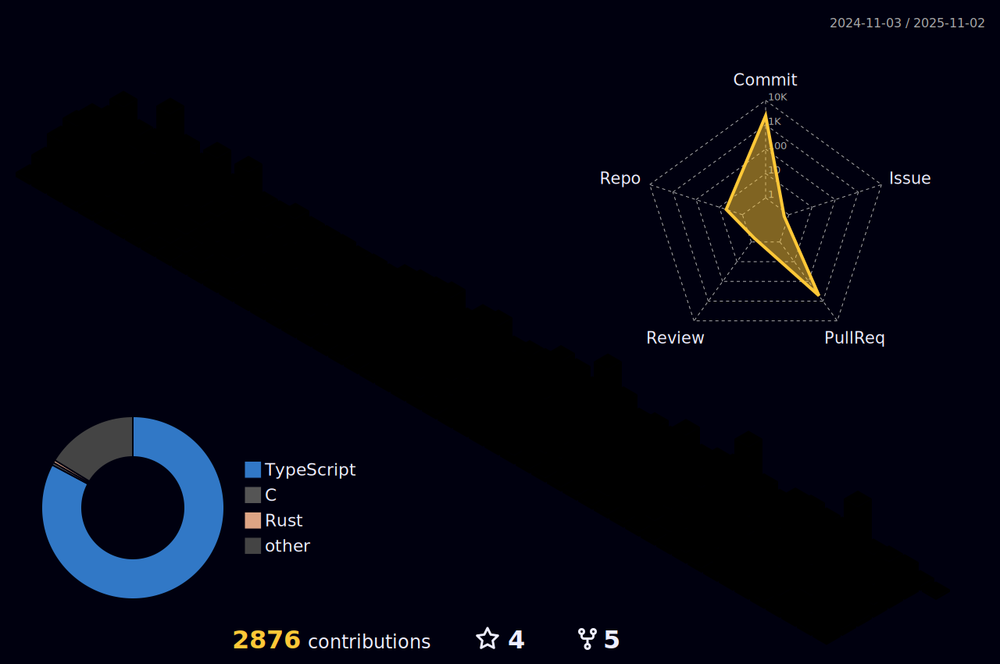

<div align="left">
  
  
### 👋 Hi there 👋
  
```javascript
function main() {
  console.log("I'm CHOI SI-HUN a growing developer. 🌱");
}
```

### 💻 Work
- **Present** 
  - 한양대학원 스마트컨스트럭션공학과 · 2026.03 ~ **Present**
  - <a href="http://www.drvalue.co.kr/">(주) 디알밸류</a> · CTO
- 2023.03 ~ 2026.02
  - 한양대학교 ERICA 스마트융합공학부 · 학부 졸업
- 2024.02 ~ 2025.10
  - <a href="http://www.drvalue.co.kr/">(주) 디알밸류</a> · BE Developer
    - 주문 제작형 PCB MES(생산 관리 시스템) · 프로젝트 PL
- 2024.02 ~ 2025.02
  - (주) 싱귤래리티 창업 · BE Developer
    - Chatnote (대학생을 위한 AI 공부 필기앱) · 백엔드 초기 개발
- 2024.02 ~ 2024.09
  - <a href="http://ksict.com/">(주) 신성아이씨티</a> · BE Developer
    - [MCC 원모바일](https://myonemobile.com/)(휴대폰 쇼핑몰 및 요금제 가입 서비스) · 백엔드 초기 개발 및 유지보수
    - [에이트리인베스트먼트](https://atreeinvestment.co.kr/)(회사 홈페이지) · 백엔드 초기 개발
    - 무비보드(영화 댓글 통합 분석 솔루션) · 백엔드 개발 및 유지보수
    - 급식 종사자 폐암 예방을 위한 조리실 오염 부유물질 측정 및 AI&빅데이터 관제 시스템(국가R&D) · 백엔드 초기 개발 및 유지보수

### 🏆 Awards
- 2023 제 10회 대한민국 SW 융합 해커톤 우수상 (2위) (세종특별자치시장상) (서울지역 대표)
- 2023 한국정보과학회 KCC2023 학부생/주니어 논문 경진 대회 논문 등재 (Privacy Guard)
- 2023 한양대학교 ERICA 1학기 SID AUDITION 원페이퍼 창업 아이디어 경진대회 SID상 (5위)
- 2023 한양대학교 ERICA 제 11회 SW 창업 아이디어톤 최우수상 (2위)
- 2023 한양대학교 ERICA 창업경진대회 우수상 (2위 한양대학교 ERICA LINC 3.0 사업단장상)
- 2023 한양대학교 ERICA SW창업동아리 우수사례 선정
- 2023 한양대학교 ERICA 2학기 SID AUDITION 원페이퍼 창업 아이디어 경진대회 SID상 (7위)
  
### 🛠 Technology Stack
  </br>
  
  <div align="left">
    
    
    
    
    
    
    
    
    
  </div>
    
### My github stats
  
</div>

